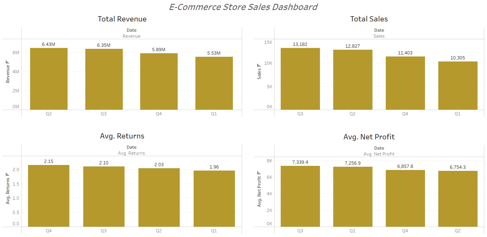

## Tableau_E-Commerce_Store_Excel_Dashboard

## Overview
This repository contains a collection of Tableau dashboards designed to provide powerful insights from raw datasets. Each dashboard leverages Tableau's visualization and reporting features to create dynamic, interactive, and visually appealing data summaries. These dashboards are ideal for users looking to streamline their data analysis, identify trends, and communicate key insights effectively.

## Features
Interactive Reports: Easily filter, sort, and analyze large datasets with Tableau's features.
Visualizations: Charts and graphs included for visual representation of data, offering clear insights into trends, distributions, and comparisons.
User-friendly Interface: Dashboards designed for ease of use, enabling users to interact with the data without needing advanced technical knowledge.
Data Filters: Simplify data filtering with easy-to-use filters for quick analysis of specific data segments.
Dynamic Updates: Dashboards automatically update when data is refreshed, making it ideal for recurring reports.

## Contents
This repository includes:

Dashboard Templates: Tableau files containing different dashboards focused on various scenarios and use cases.
Sample Data: Datasets used for generating the dashboards, showcasing data from multiple domains.
Documentation: Descriptions of each dashboard with details on how to interact with them and what insights they provide.

## How to Use
Access the desired dashboard template from the repository.
Open the template in Tableau Desktop or Tableau Public.
Interact with the charts and filters to explore the data.
For datasets that are regularly updated, simply refresh the data source to see the dashboard automatically adjust to reflect the new data.

## Prerequisites
Tableau Desktop or Tableau Public: Required for accessing and using the dashboards.
Basic Knowledge of Tableau: Familiarity with Tableau's interface is useful but not required.

## Contact
For any questions or suggestions, feel free to reach out:

GitHub: Sanchit Goel
Email: goelsanchit29@gmail.com